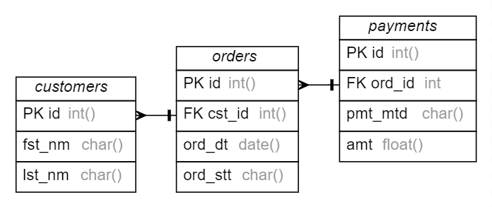
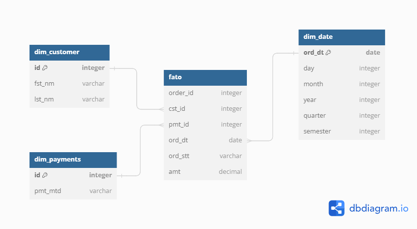
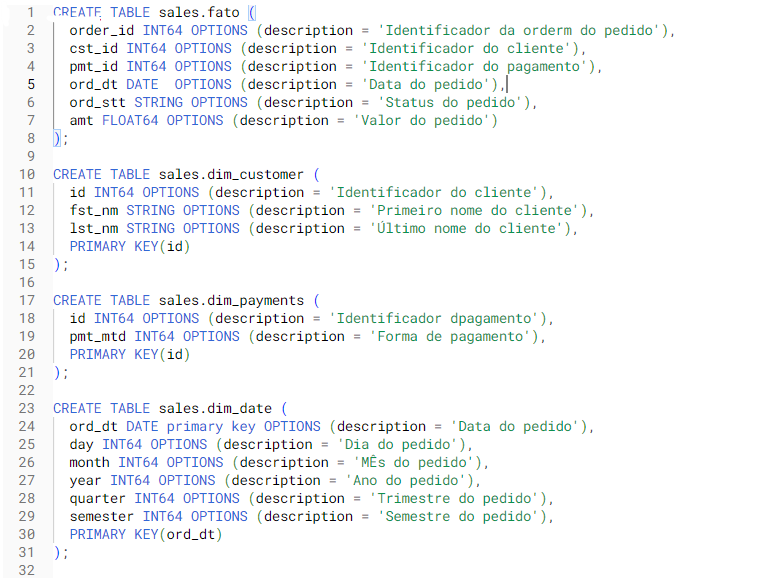

# Projeto do MBA de Engenharia de Dados
Trabalho de Modelagem para MBA Engenharia de Dados Mackenzie
### Big Data Processig

# Case de Negócio

Pense em uma empresa, desenhe as tabelas Relacionais e Multidimensionais

1. Pense no nome do Domínio de informação e da Sigla
2. Pense no modelo de negócio e crie os campos com nomes lógicos e físicos
3. Crie o Glossário de Dados
4. Desenhe as tabelas físicas e lógicas Relacionais com as (Chave PK e campos)
5. Crie as tabelas Fato e Dimensão
6. Crie o Script SQL para criar a tabela FATO (Extract / Data Collection)

Para essa atividade pode ser utilizado o Draw.io para criar os desenhos das tabelas.

## Empresa
Sales Data

## 1. Nome do Domínio de Informação e da Sigla
**Domínio de informação**: Vendas Corporativas

**Sigla**: VEND

## 2. Modelo de negócio e campos com nomes lógicos e físicos

### Customer (customer)

| Lógico             | Físico    | Chave |
|--------------------|-----------|-------|
| Código do Cliente  | `id`      | PK    |
| Primeiro Nome      | `fst_nm`  |       |
| Sobrenome          | `lst_nm`  |       |

### Orders (orders)

| Lógico              | Físico     | Chave |
|---------------------|------------|-------|
| Código do Pedido    | `id`       | PK    |
| Código do Cliente   | `cst_id`   | FK    |
| Data do Pedido      | `ord_dt`   |       |
| Status do Pedido    | `ord_stt`  |       |

### Payments (payments)

| Lógico              | Físico     | Chave |
|---------------------|------------|-------|
| Código do Pagamento | `id`       | PK    |
| Código do Pedido    | `ord_id`   | FK    |
| Método de Pagamento | `pmt_mtd`  |       |
| Valor do Pagamento  | `amt`      |       |

## 3. Crie o Glossário de Dados

| Campo              | Descrição                                                          |
|--------------------|--------------------------------------------------------------------|
| customer.id        | Identificador único do cliente.                                    |  
| customer.fst_nm    | Primeiro nome do cliente.                                          |
| customer.lst_nm    | Sobrenome do cliente.                                              |
| orders.id          | Identificador único do pedido.                                     |
| orders.cst_id      | Identificador do cliente que fez o pedido.                         |
| orders.ord_dt      | Data em que o pedido foi realizado.                                |
| orders.ord_stt     | Status atual do pedido (ex: pendente, concluído).                  |
| payments.id        | Identificador único do pagamento.                                  |
| payments.ord_id    | Identificador do pedido relacionado ao pagamento.                  |
| payments.pmt_mtd   | Método utilizado para pagamento (ex: cartão de crédito, PayPal).   |
| payments.amt       | Valor total do pagamento.                                          |

## 4. Desenhe as tabelas físicas e lógicas Relacionais com as (Chave PK e campos)

### Tabelas Físicas

### Customer

| Campo       | Tipo        | PK  | Nullable |
|-------------|-------------|-----|----------|
| id          | INT         | SIM | NÃO      |
| fst_nm      | VARCHAR(50) | NÃO | NÃO      |
| lst_nm      | VARCHAR(50) | NÃO | NÃO      |

### Orders

| Campo       | Tipo        | PK  | Nullable |
|-------------|-------------|-----|----------|
| id          | INT         | SIM | NÃO      |
| cst_id      | INT         | NÃO | NÃO      |
| ord_dt      | DATE        | NÃO | NÃO      |
| ord_stt     | VARCHAR(20) | NÃO | NÃO      |

### Payments

| Campo          | Tipo          | PK  | Nullable |
|----------------|---------------|-----|----------|
| id             | INT           | SIM | NÃO      |
| ord_id         | INT           | NÃO | NÃO      |
| pmt_mtd        | VARCHAR(20)   | NÃO | NÃO      |
| amt            | DECIMAL(10,2) | NÃO | NÃO      |

### Tabelas lógicas Relacionais com as (Chave PK e campos)

## 5. Crie as tabelas Fato e Dimensão

## 6. Crie o Script SQL para criar a tabela FATO (Extract / Data Collection)

